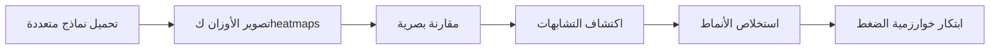

# 🧬 خطة تحويل DNA من أطروحة إلى مشروع جدي

## الرؤية الجديدة (بناءً على توجيهاتك)

> **"لا تضغط قبل أن تفهم. افهم بعينيك أولاً."**

تشبيه طي الملابس عبقري: لا يمكنك اختراع طريقة طي موحدة للقميص والجلباب والمظلة إلا بعد أن **تراها** وتفهم شكلها.

---

## 📊 تحليل الوضع الحالي

### ما هو موجود ✅

| المكون | الملفات | الحالة |
|--------|---------|--------|
| **SIREN Networks** | [src/dna/siren.py](file:///d:/git/dna/src/dna/siren.py) | 3 أنواع: SpectralDNA, Hierarchical, Adaptive |
| **Weight Extraction** | [src/dna/weight_dataset.py](file:///d:/git/dna/src/dna/weight_dataset.py) | يعمل على HuggingFace models |
| **Pattern Mining** | [src/dna/pattern_miner.py](file:///d:/git/dna/src/dna/pattern_miner.py) | تدريب SIREN على الأوزان |
| **Visualization** | [src/dna/pattern_visualizer.py](file:///d:/git/dna/src/dna/pattern_visualizer.py) | 9+ أنواع (matplotlib ثابتة) |
| **REST API** | `api/` | FastAPI مع endpoints للنماذج والأنماط |
| **Database** | `database/` | SQLite لتخزين النماذج والتجارب |
| **Frontend** | `static/` | Dashboard أساسي |

### ما ينقص ❌

1. **لا يوجد Tiny Model Switcher** - مجرد تنزيل وتخزين
2. **Visualization ثابتة** - matplotlib لا تسمح بالاستكشاف الحر
3. **لا Heatmaps للأوزان** - لا نرى الأوزان كصور
4. **لا مقارنة بصرية** - لا يمكن وضع نموذجين جنباً لجنب
5. **لا يوجد "رؤية بالعين"** - التركيز على الأرقام فقط

---

## 🎯 خطة التحويل: 3 مراحل

```
┌─────────────────────────────────────────────────────────────────┐
│  المرحلة 1        المرحلة 2           المرحلة 3                 │
│  ──────────        ──────────           ──────────                │
│                                                                  │
│  Tiny Model   →   Weight            →   Pattern                  │
│  Switcher         Heatmaps              Discovery                │
│                                                                  │
│  "تشغيل"          "رؤية"                "فهم"                    │
└─────────────────────────────────────────────────────────────────┘
```

---

## المرحلة 1: Tiny AI Model Switcher 🔌

### الهدف
أداة بسيطة مثل Ollama لكن للنماذج **الصغيرة جداً** (< 100M params) تعمل على الأجهزة الشخصية.

### التغييرات المطلوبة

#### [MODIFY] [models.py](file:///d:/git/dna/api/models.py)
- إضافة endpoint لـ **inference** وليس فقط تنزيل
- دعم multiple backends (transformers, GGUF, ONNX)
- إضافة model cards مع المعلومات الأساسية

#### [NEW] model_runner.py
```
d:\git\dna\src\dna\model_runner.py
```
- Class موحد لتشغيل النماذج الصغيرة
- دعم Text Generation, Embeddings, Classification
- Streaming output

#### [MODIFY] [index.html](file:///d:/git/dna/static/index.html)
- واجهة بسيطة لاختيار وتشغيل النماذج
- Chat interface للتفاعل مع النماذج

### Model Zoo المقترح (Tier 1)

| النموذج | الحجم | النوع | الاستخدام |
|---------|-------|-------|-----------|
| TinyBERT | 14.5M | Encoder | Embeddings |
| ELECTRA-small | 14M | Encoder | Classification |
| MiniLM-L6 | 22M | Encoder | Sentence similarity |
| DistilGPT2 | 82M | Decoder | Text generation |
| Whisper-tiny | 39M | Audio | Speech-to-text |

---

## المرحلة 2: Weight Heatmap Visualization 🗺️

### الهدف
> **"رؤية الأوزان كخرائط حرارية لاكتشاف الأنماط بالعين"**

### الفكرة الأساسية

```
Weight Matrix [768, 768]  →  Heatmap Image  →  Visual Patterns!
                                ↓
                          🔴🟠🟡🟢🔵  (color = weight value)
```

### التغييرات المطلوبة

#### [NEW] weight_heatmap.py
```
d:\git\dna\src\dna\weight_heatmap.py
```
```python
class WeightHeatmapGenerator:
    """تحويل مصفوفات الأوزان إلى خرائط حرارية مرئية"""
    
    def matrix_to_heatmap(self, weights: np.ndarray, 
                          colormap: str = 'RdBu') -> Image:
        """تحويل مصفوفة واحدة لصورة حرارية"""
        
    def layer_panorama(self, model) -> Image:
        """كل layers في صورة واحدة طويلة"""
        
    def attention_pattern_viz(self, model) -> Image:
        """تصوير أنماط Attention خاصة"""
        
    def compare_models(self, model_a, model_b) -> Image:
        """مقارنة جنباً لجنب"""
```

#### [NEW] interactive_explorer.py
```
d:\git\dna\src\dna\interactive_explorer.py
```
- استخدام **Plotly** بدلاً من matplotlib
- Zoom/Pan/Rotate تفاعلي
- Hover لرؤية القيم
- Toggle للـ layers

#### [MODIFY] [pattern_visualizer.py](file:///d:/git/dna/src/dna/pattern_visualizer.py)
- إضافة heatmap visualization
- دعم تصدير كـ images (PNG/WebP)
- Animation عبر الـ layers

### أنواع التصوير المقترحة

````carousel
### 1. Layer Heatmaps
كل layer كصورة حرارية منفصلة
```
Layer 0:  🔴🟠🟡🟢
Layer 1:  🔵🟣🟠🔴
Layer 2:  🟢🔵🟡🟠
```
<!-- slide -->
### 2. Attention Patterns
تصوير مصفوفات Q, K, V
```
Q: ████████████
K: ████████████
V: ████████████
```
<!-- slide -->
### 3. Model Comparison
نموذجين جنباً لجنب
```
TinyBERT    vs    ELECTRA
████████          ████████
████████          ████████
```
<!-- slide -->
### 4. Weight Distribution
توزيع الأوزان كـ histogram مع الـ heatmap
```
[Histogram] [Heatmap]
```
````

---

## المرحلة 3: Pattern Discovery → Compression 🔬

### الفلسفة

> **"لا تضغط الأنماط قبل أن تكتشفها"**

التشبيه:
- **طي الملابس**: لا تخترع طريقة طي عمياء - انظر للشكل أولاً
- **طي البروتين**: الهيكل يحدد الوظيفة والطي
- **DNA الحمض النووي**: 4 قواعد تولد كل التنوع البيولوجي

### الخطوات



### التغييرات المطلوبة

#### [NEW] pattern_discovery.py
```
d:\git\dna\src\dna\pattern_discovery.py
```
```python
class PatternDiscovery:
    """اكتشاف الأنماط بالتحليل البصري والإحصائي"""
    
    def extract_visual_features(self, heatmaps: List[Image]):
        """استخلاص features من الـ heatmaps"""
        
    def find_similar_patterns(self, models: List[str]):
        """البحث عن أنماط متشابهة بين النماذج"""
        
    def cluster_by_pattern(self, models: List[str]):
        """تجميع النماذج حسب تشابه الأنماط"""
        
    def suggest_compression(self, discovered_patterns):
        """اقتراح طريقة ضغط بناءً على الأنماط المكتشفة"""
```

#### [NEW] compression_lab.py
```
d:\git\dna\src\dna\compression_lab.py
```
- مختبر لتجربة خوارزميات ضغط مختلفة
- مقارنة النتائج
- **بعد** اكتشاف الأنماط وليس قبلها

---

## التحقق (Verification Plan)

### اختبارات موجودة
```bash
# تشغيل الاختبارات الموجودة
pytest tests/ -v
```

### اختبارات جديدة

#### للمرحلة 1 (Model Switcher)
```bash
# Test: تحميل وتشغيل TinyBERT
python -c "from dna.model_runner import ModelRunner; r = ModelRunner(); print(r.run('tinybert', 'Hello world'))"
```

#### للمرحلة 2 (Heatmaps)
```bash
# Test: توليد heatmap لنموذج
python -c "from dna.weight_heatmap import WeightHeatmapGenerator; g = WeightHeatmapGenerator(); g.generate('tinybert', 'output.png')"
```

### اختبار يدوي (للمستخدم)
1. تشغيل `python app.py`
2. فتح `http://localhost:8058`
3. اختيار نموذج من القائمة
4. التحقق من ظهور الـ heatmaps
5. مقارنة نموذجين بصرياً

---

## الأولويات

### فوري (هذا الأسبوع)
1. ⭐ إنشاء `weight_heatmap.py` - **البداية من الرؤية**
2. تعديل Dashboard لعرض الـ heatmaps

### قصير المدى (أسبوعين)
3. Model Switcher بسيط
4. مقارنة نموذجين جنباً لجنب

### متوسط المدى (شهر)
5. Pattern Discovery التلقائي
6. Compression Lab

---

## ملاحظات مهمة

> [!IMPORTANT]
> **فلسفة التطوير الجديدة:**
> - الرؤية قبل الضغط
> - الفهم قبل الخوارزمية
> - التشابه بين النماذج هو مفتاح الاكتشاف

> [!TIP]
> ابدأ بـ TinyBERT و ELECTRA-small فقط - نموذجين متقاربين في الحجم لكن مختلفين في التدريب. إذا وجدت أنماط متشابهة، فهذا دليل على وجود "قوانين" عالمية.

---

## السؤال الأساسي للبحث

> **"هل النماذج المختلفة (التي دُربت بطرق مختلفة على بيانات مختلفة) تتشارك في أنماط توزيع الأوزان؟"**

إذا كانت الإجابة **نعم** → يمكننا اختراع ضغط ثوري
إذا كانت الإجابة **لا** → كل نموذج يحتاج ضغط خاص
